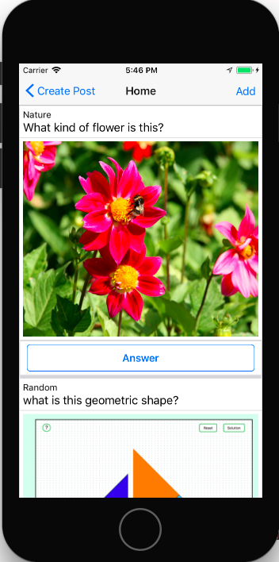
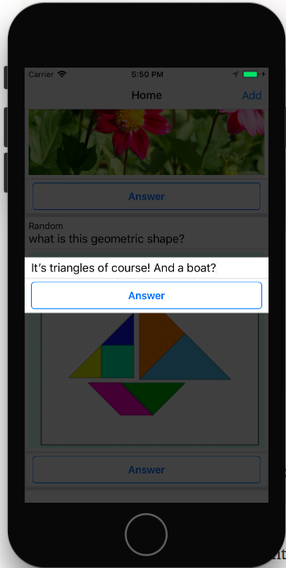
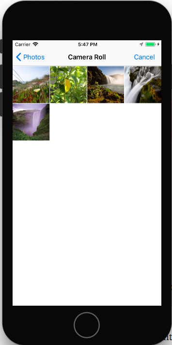
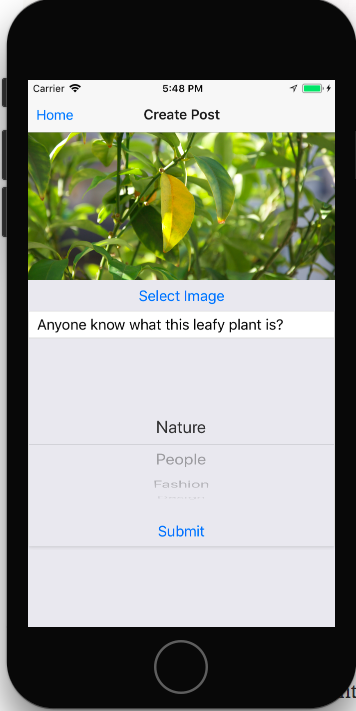

# Wit - What is this?
Wit is an all purpose identify app. Users upload pictures of things they want to have identified or know the name of, and other users answer. Everyone is an expert of something!

- __Wit prioritizes accessibility:__ Making user accounts and passwords for every little web service is one of the most annoying things about the internet. Instead of User Authentication Wit makes use of iOS' `identifierForVendor` property to keep track of a user's settings and posts. In addition React Native's `AsyncStorage` is utilized to store session info in the devices local storage. No logins. If a user changes their device, they'll lose their data, but that's okay, because post get recycled after a while anyway.

- __Fast turnaround:__ Old posts are recycled as the app doesn't serve as a
searchable archive. What would you search for anyway? Users come here to
post a picture of something they want to identify because googling for it
proved difficult.

## Technologies
Wit uses the MERN stack (MongoDB, Express.js, React Native, Node.js),
allowing for both client-side and server-side JavaScript and JSON. Mongoose helped with easy schema setup for the NoSQL database, and Node.js with
Express provides a light weight backend.

On the front-end we use React Native for modularity and Redux for its
reliable state handling and uni-directional data flow.

## Features and Implementation
* __Feed:__ Wit's home screen is a `Feed` of all identify-asks, which
consist of a screen-wide picture, a brief description, and a category.

* __Answers:__ If you see something you know or are also curious about, leave your answer in the popup modal and submit. `Answers` are just that (and hopefully helpful).
Combined knowledge is endless.

* __Categories:__ `Categories` like Nature, People, Fashion, Design, or
Objects give context to an ask, and provide a way for Fashion experts
(or interested amateurs) to browse only what's in the Fashion feed.

* __Image Uploads and New Posts:__ When you add your own ask, the main focus of it is
an image. Since you most likely snapped the item in question with your
phone camera anyway, Wit provides users with easy-access photo uploads from their
phone's camera roll. Pictures are safely stored with Cloudinary and will
be deleted along with their posts after about a week.

## Technical Details
(Code Snippets!)

## Future Development
* Wit should be on the app store as a full-fledged mobile application.
* As the user base grows, Wit will need to upgrade its image storage
solution, and possibly migrate to AWS.
* Android version of the Wit. More users, more answers.
* With a larger user base, we can see wanting a way to distinguish good
answers from bad ones. We'd develop a user clout system. Answers would be
sorted by upvotes, and users would receive clout for high-vote answers
in general and specific categories. Users would then have a user account,
so they wouldn't lose their clout when switching devices.
